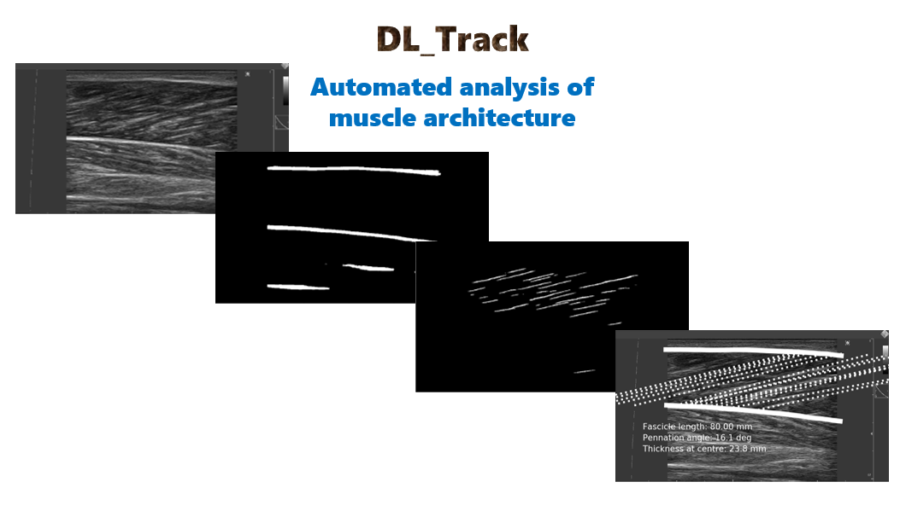

# DL_Track
A deep learning approach for analysing muscle architecture from musculoskeletal ultrasound images.

---------------------------------------------------------------------------------------------------------------------------
### A new version of this repo and the DL_Track algorithm can be found [here](https://github.com/PaulRitsche/DL_Track_US)
---------------------------------------------------------------------------------------------------------------------------

To start using this software on your own computer, first use the [setup instructions](https://github.com/njcronin/DL_Track/blob/master/python_setup.md).

To train your own model, you can add your own images and labels to those that are provided, or you can create your own dataset ([labelling instructions can be found here](https://github.com/njcronin/DL_Track/blob/master/Labelling_Instructions.pdf)). Then use the ['Model_Training.ipynb'](https://github.com/njcronin/DL_Track/blob/master/Model_Training.ipynb) notebook to train your model (NOTE: Use a GPU!).

To use my trained models to analyse your own data, simply run the ['Inference_Single_Image.ipynb'](https://github.com/njcronin/DL_Track/blob/master/Inference_Single_Image.ipynb) or ['Inference_Video.ipynb'](https://github.com/njcronin/DL_Track/blob/master/Inference_Video.ipynb) Jupyter notebook to analyse individual images or videos respectively. Note that in your images/videos, the fascicles should be oriented from bottom-left to top-right (see image below). If they are not, set the 'flip' variable in the notebook to 1 instead of 0.

If you don't have access to a GPU or couldn't get the main version working, try using the colab version ([instructions here](https://github.com/njcronin/DL_Track/blob/master/colab_instructions.md)). This is more limited, but most of the functionality is the same.

If you find this work useful, please cite the corresponding paper: https://arxiv.org/abs/2009.04790

